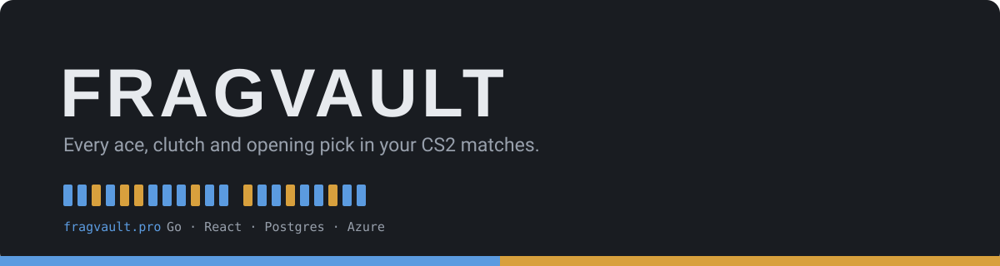
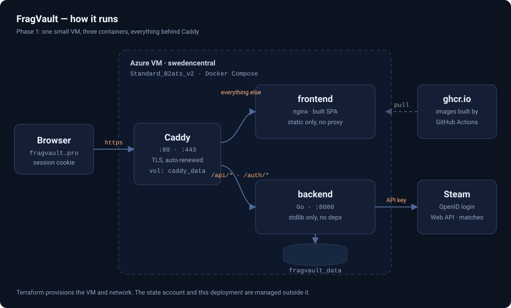

<p align="center">
  
</p>

CS2 highlight discovery and creation. Phase 1 (this repo's current state): sign in with Steam, discover recent matches, list them.

**The Phase 1 POC is live at [fragvault.pro](https://fragvault.pro)** — Steam login, onboarding, and match discovery all work end to end. It runs as containers on a single small Azure VM behind Caddy, which terminates TLS.

> Onboarding gotcha: the starting sharecode you paste is **exclusive**. Discovery walks *forward* from it, so pasting your most recent match's code finds nothing. Use an older one.

## How it runs

<p align="center">
  
</p>

## Roadmap

**Phase 1 — Match discovery** ✅ *live*
Sign in with Steam, onboard once, and have your recent matches discovered by walking sharecodes forward.

**Phase 2 — Analyse demos**
Fetch the `.dem` for a discovered match and parse it for highlight-worthy moments: multi-kills, clutches, opening duels, defuses. A sharecode already decodes to the match ID, reservation ID and TV port (`backend/internal/matches/sharecode.go`), which is what locating the replay needs. This phase is pure backend — no rendering yet, just "here is a list of timestamps worth watching".

**Phase 3 — Create highlights**
Turn those timestamps into actual video. A GPU VM runs CS2 against the demo and records the clip; a Function App orchestrates the job so nothing expensive stays running between renders; finished clips land in blob storage. All three already exist in Terraform behind `enable_gpu_render_vm`, `enable_function_app` and `enable_blob_storage`, disabled so they can't bill before the phase starts. The GPU VM is by far the most expensive resource in this repo — it should be created per job and destroyed after.

**Phase 4 — Share with friends**
Short links to rendered clips, served from blob storage through time-limited SAS URLs rather than a public container. Wants a clip page with an OpenGraph preview so a link dropped into Discord unfurls properly.

**Phase 5 — FACEIT connectivity**
Pull matches and demos from FACEIT alongside Valve matchmaking. FACEIT exposes both through its own API and hosts demos directly, so it sidesteps the game-auth-code onboarding entirely — and for a lot of players it's where the matches worth clipping actually happen.

### Also on the list

Smaller things, roughly in the order they'll start to hurt:

- **Encrypt the Valve auth codes at rest.** They currently sit in plaintext in a JSON file on the VM. Fine for a single user; not fine for the first stranger who trusts the site with one.
- **Move off the single JSON file.** Every write rewrites the whole thing under a mutex — a deliberate POC tradeoff (`backend/internal/matches/store.go`) that stops being reasonable somewhere in the tens of users.
- **Show real match metadata** — map, score, date. The list currently shows a sharecode and the time it was *discovered*, which isn't when it was played.
- **A logout button.** `POST /auth/logout` already works; nothing in the UI calls it.
- **Distinguish a rejected auth code from "no new matches".** The poller treats a 404 as "nothing newer", so bad credentials look exactly like an empty result.
- **Poll in the background** instead of on every `/api/matches` request, and stay clear of the Steam API rate limit as users are added.
- **Automate deployment.** It's a manual `docker compose pull && up -d` on the VM today.

## Layout

- `frontend/` — React + TypeScript + Vite POC UI
- `backend/` — Go HTTP API (Steam auth + match polling)
- `function-app/` — placeholder for the later demo-rendering phase
- `infrastructure/` — Terraform for all infra (only the hosting VM is enabled by default; the rest sits behind `enable_*` variables so nothing bills before its phase starts)
- `deploy/` — compose file and Caddyfile that run the app on the VM

## Running locally

**Backend:**

```sh
cd backend
export BASE_URL=http://localhost:8080
export STEAM_WEB_API_KEY=your-steam-web-api-key   # https://steamcommunity.com/dev/apikey
export SESSION_SECRET=some-random-string
export DEV_INSECURE_COOKIE=true                    # allows the session cookie over plain http locally
go run ./cmd/server
```

**Frontend:**

```sh
cd frontend
npm install
npm run dev
```

The Vite dev server proxies `/api` and `/auth` to `http://localhost:8080` (see `vite.config.ts`), so both need to be running together.

## Deploying

### The application

Both services are published as container images to ghcr.io on every push to `main`, then run on the VM with compose behind Caddy. Deployment is manual for now:

```sh
cd /opt/fragvault && docker compose pull && docker compose up -d
```

`/opt/fragvault` holds `compose.yaml` and `Caddyfile` (copies of the ones in `deploy/`) plus a `.env` that exists only on the VM — see [`deploy/.env.example`](deploy/.env.example) for its contents. Caddy obtains and renews the certificate for `fragvault.pro` by itself, which is why port 80 must stay open alongside 443.

Two volumes hold everything stateful: `caddy_data` (certificates — `docker compose down -v` forces reissue and Let's Encrypt's rate limits are unforgiving) and `fragvault_data` (onboarded users and their discovered matches).

### The infrastructure

Terraform in `/infrastructure` provisions the Azure VM (and, later, the other infra pieces). Applied via GitHub Actions CI, not locally — see the workflow in `.github/workflows/`. A plan runs automatically on PRs and on merge to `main`; applying is a manual approval on the `production` environment in that same run.

**One-time state bootstrap.** Terraform state lives in an Azure Storage account that Terraform itself doesn't manage (it can't safely manage the thing holding its own state). Create it once with:

```sh
CI_CLIENT_ID=<the AZURE_CLIENT_ID repo secret> infrastructure/bootstrap/bootstrap-tfstate.sh
```

The script is idempotent and puts the account in its own resource group, so `terraform destroy` on the app resources can't take the state with it. The backend authenticates via Entra ID with the same service principal as the rest of CI, so there's no storage access key to store as a secret.

**SSH key.** The `HOSTING_VM_SSH_PUBLIC_KEY` secret must hold an **RSA** key — Azure rejects ed25519 for Linux VM provisioning, even though it's the better algorithm everywhere else:

```sh
ssh-keygen -t rsa -b 4096 -C fragvault -f ~/.ssh/id_rsa_fragvault
```

**Resource providers.** A fresh subscription has nothing registered beyond `Microsoft.Resources`, and the error you get is a misleading `(SubscriptionNotFound) Subscription <id> was not found`. The bootstrap script registers `Microsoft.Storage`; the VM needs two more:

```sh
az provider register --namespace Microsoft.Compute --wait
az provider register --namespace Microsoft.Network --wait
```
